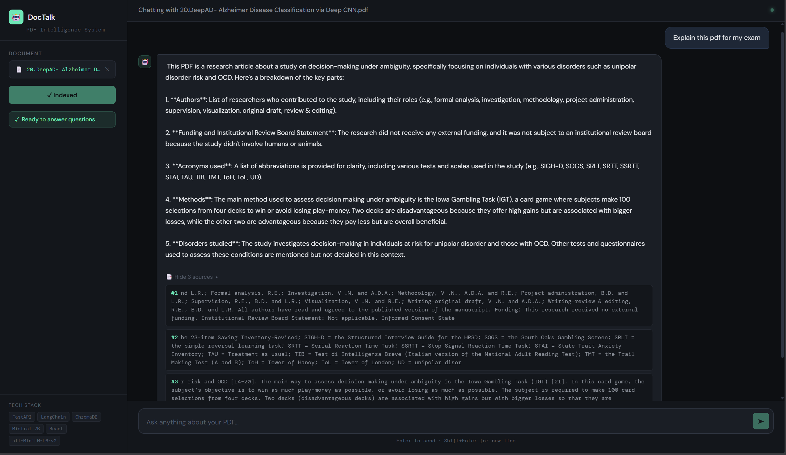

# 🤖 DocTalk — PDF Intelligence System

A full-stack RAG (Retrieval-Augmented Generation) system that lets users 
upload PDFs and ask natural language questions about the content.



## 🛠️ Tech Stack
| Layer | Technology |
|---|---|
| Frontend | React, Axios |
| Backend | FastAPI, Python |
| AI Framework | LangChain |
| Embeddings | Sentence Transformers (all-MiniLM-L6-v2) |
| Vector DB | ChromaDB |
| LLM | Mistral 7B via Ollama |

## ⚙️ How It Works
1. PDF is uploaded and split into chunks
2. Each chunk is embedded using Sentence Transformers
3. Embeddings stored in ChromaDB vector database
4. User question is embedded and matched to relevant chunks
5. Mistral 7B generates a grounded answer from retrieved context

## 🚀 Run Locally

### Backend
```bash
cd backend
pip install -r requirements.txt
ollama pull mistral
uvicorn main:app --reload
```

### Frontend
```bash
cd frontend
npm install
npm start
```

## 📁 Project Structure
```
rag-pdf-project/
├── backend/
│   ├── main.py
│   ├── document_processing/
│   ├── embeddings/
│   ├── vector_store/
│   └── rag/
├── frontend/
│   └── src/
│       └── App.jsx
└── README.md
```